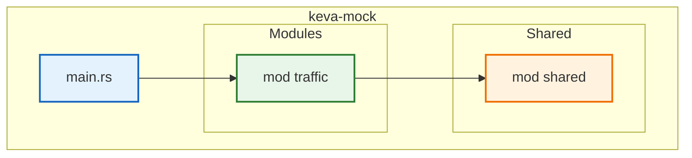
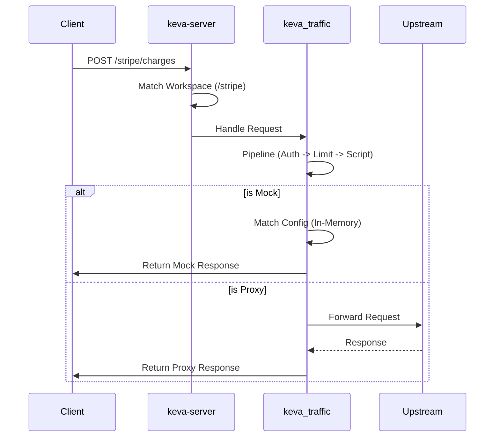

# Technical Architecture: keva-mock

| Document | Technical Design (TDD) |
| :--- | :--- |
| **Version** | 1.0|
| **Architecture** | Vertical Slice (Modular Monolith) |
| **Stack** | Rust (Workspace) |

---

## 1. Architectural Pattern

The system follows a **Vertical Slice Architecture**. Code is organized by **Functional Capability** (Traffic) rather than technical layers. Each slice is a **Rust Module** with strict visibility rules (using `pub(crate)` vs `pub`).

**Dependency Flow:**
`main.rs (Wiring) → modules/ (Feature) → shared/ (Kernel)`



## 2. Directory Structure (Single Crate)

A single binary crate with well-defined module boundaries.

```text
keva_mock/
├── Cargo.toml                 # Single Dependency Manifest
├── src/
│   ├── main.rs                # App Wiring
│   ├── shared.rs              # Shared Kernel Entry
│   ├── shared/
│   │   └── error.rs           # AppError
│   ├── modules.rs             # Modules Entry
│   └── modules/
│       ├── traffic.rs         # Traffic Slice Entry
│       ├── traffic/
│       │   ├── domain/        # Pure Logic
│       │   └── infra/         # Axum Handlers
└── infra/                     
    └── docker-compose.yml     # Local Dev Environment
```

### 2.1 Module Boundaries

- **Visibility**: We use `pub(super)` or `pub(crate)` to hide internal slice details. Only the "Public API" of the slice (e.g., `pub fn init_routes()`) is exposed to `main.rs`.

## 3. Data Flow (Request Processing)

Explicit mapping prevents internal domain details from leaking to the API contract.



## 4. Concurrency & Persistence

- **Configuration**: File-based (TOML). Loaded into memory at startup. Read-heavy.

## 5. Technology Stack

| Component | Technology | Description |
| :--- | :--- | :--- |
| **Language** | Rust 1.75+ | core logic. |
| **Web Framework** | Axum 0.7+ | HTTP layer. |
| **Runtime** | Tokio | Async I/O. |
| **Stack** | Rust (Workspace) |
